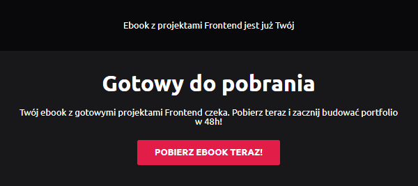

# 💻 Lead Squeeze Funnel

This web app is a ready-to-use template for a lead squeeze funnel, inspired by the book "Dotcom Secrets". It helps collect emails from visitors to build your marketing list quickly and effectively.

The app validates emails for correct format, handles errors gracefully, and prevents access to the /success subpage until a valid email is provided. It checks the MongoDB database (connected via Mongoose) to avoid duplicate signups. Once validated, it sends a personalized email to the user using Nodemailer, with responsive designs created via MJML. The email features a strong call-to-action (CTA) button to download the ebook right away. All registered users are securely stored in MongoDB for future campaigns.

Ideal for marketers and developers wanting a simple, high-converting lead capture page!

## ⚙️ Technologies

[](https://skillicons.dev)

## ⭐ Key features

- Email validation
- Error handling
- You can't access the `/success` subpage without providing an email
- Check if the email already exists in the database
- Send an email to the user's provided address
- Email message with a CTA to download the ebook
- MongoDB database with a list of registered users

## 👀 Preview


<table>
  <tr>
    <td></td>
    <td></td>
  </tr>
</table>

## 📄 File .env

```env
GMAIL_HOST=<host>
GMAIL_USER=<your email>
GMAIL_PASS=<your email password>
MONGODB_URI=<mongodb connect url>
```

## 💼 License

The [MIT License](./LICENSE) (MIT). Please see License File for more information.

## 🔎 See Also

[My GitHub profile](https://github.com/OKE225)
